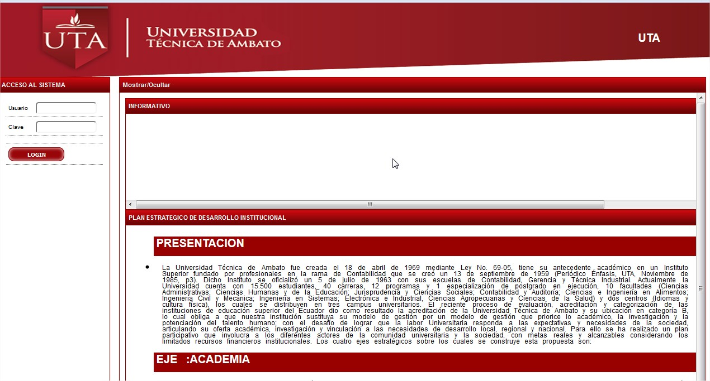

# ACCESO

Una vez que se ingrese a la ruta de acceso al sistema se displiega la página en la que se muestra la información de usuario y clave.

El usuario y la clave segun estructura interna tiene acceso tipo:

OPERADOR : Registro de información en los módulos

APROBADOR : Aprobación de módulos de POA Y PAC

Una vez ingresada en usuario y clave debe dra click y se refleja la siguiente pantalla

Una vez los datos se han accedido de manera correcta ingresamos a:
