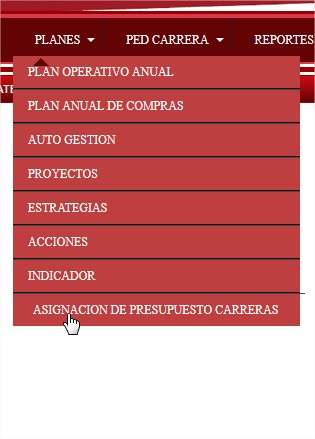
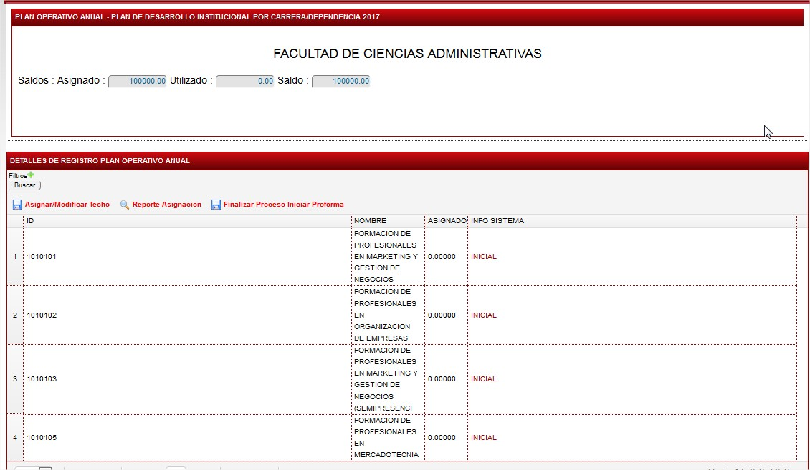
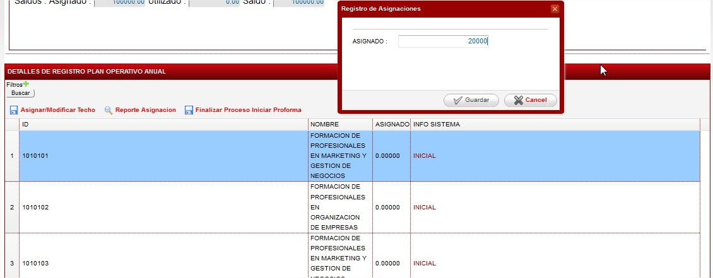
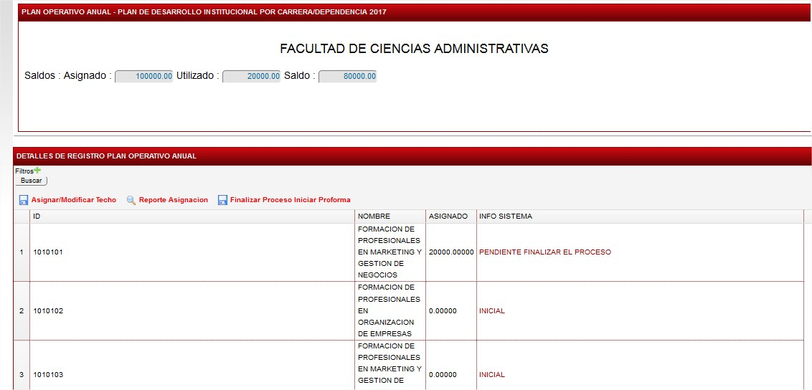
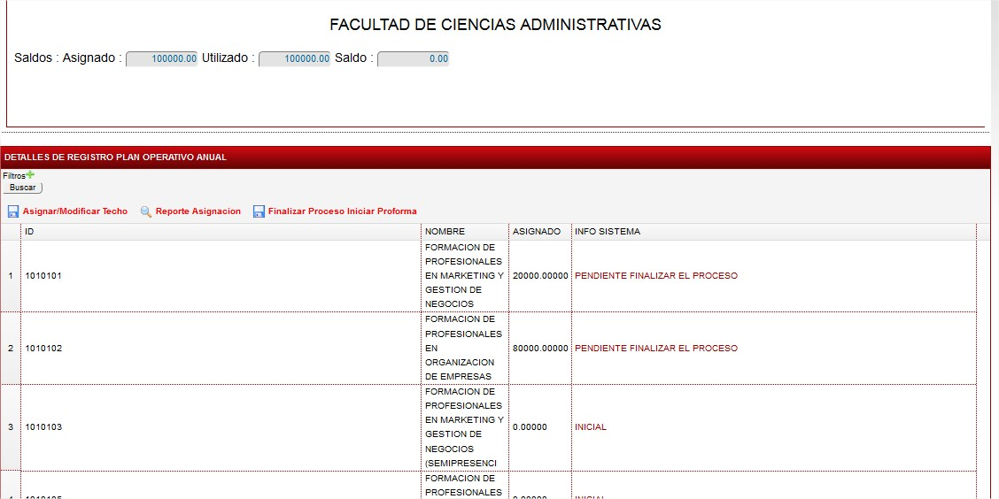
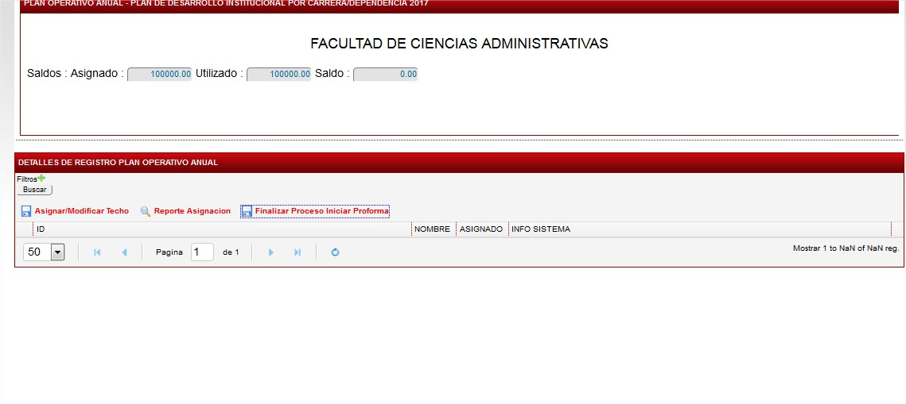

# ASIGNACION DE TECHOS

[REGISTRO PLAN OPERATIVO ANUAL](registro-plan-operativo-anual.md)Para realizar la asignación de techos en las carreras se debe seguir la sigueinte ruta :

En la ruta que se refleja en la imagen.

En la que se puede observar el vlaor global asignado a la facultad para q la divida en las carreras que tiene.

Para asignar el techo a la carrera se lo puede realizar :

Marcando la carrera y dando click en ASIGNAR /MODIFICAR TECHO y se muetra el dialogo para que pueda asiganr el techo a al carrera :

En la que se puede observar que el techo de la Facultad disminuye el saldo y se incrementa el utilizado.

Este proceso se lo debe realizar hasta que en el UTILIZADO SEA 0.

Finalmente se debe dar click en FINALIZAR PROCESO INICIAR PROFORMA para poder realizar el modulo del PLAN ANUAL DE COMPRAS.

