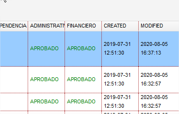

# BIENES SERVICIO REVISION

Para acceder a este módulo debe acceder mediante :&#x20;

.png>)

Una vez ingresada se puede ver la siguiente interfaz  :

.png>)

En la cual se puede realizar  :&#x20;

Y se genera la siguiente interfaz de registro :&#x20;

.png>)

En el cual se solicita la siguiente información : &#x20;

Item Presupuestario : Del listado de items presupuestarios que se despliegue , dato tomado del Clasificador Presupuestario MEF.

Medida : Del listado de medidas habilitadas por SERCOP.

Tipo : Tipo de bienes , servicios , obras habilitados por  SERCOP.

Descripción : Descripción del bien o servicio que se va a registrar para cargar en el sistema.

Especificación: Datos mas especificos del bien o servicio a registrar para cargar en el sistema .

VU : Valor Unitario incluido Iva&#x20;

Detalle DAD/FINAN:

Una vez registrada dar click en grabar , debe considerar que el sistema tiene un control de duplicados en item presupuestario y descripción en el cual se genera un mensaje como el siguiente :

.png>)

.png>)

En ese caso se debe cambiar al descripción si se desea registrar como bien nuevo.

**OPCIONES :**

Segun el perfil de acceso tienen las opciones que se habilitan :

Editar : Edición de los datos registrados.

Eliminar : Eliminar un registro de los datos registrados

Direccion Financiera , Aprobar , Reversar: Permite aprobar o reversar un registro nuevo registrado por las facultades o direcciones.

.png>)

Direccion Administrativa , Aprobar , Reversar : Permite aprobar o reversar un registro nuevo registrado por las facultades o direcciones.

