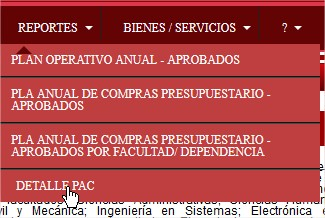
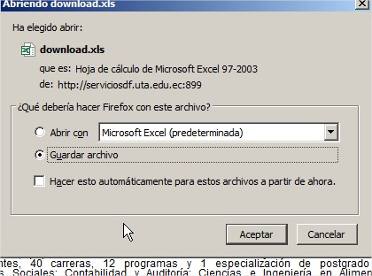
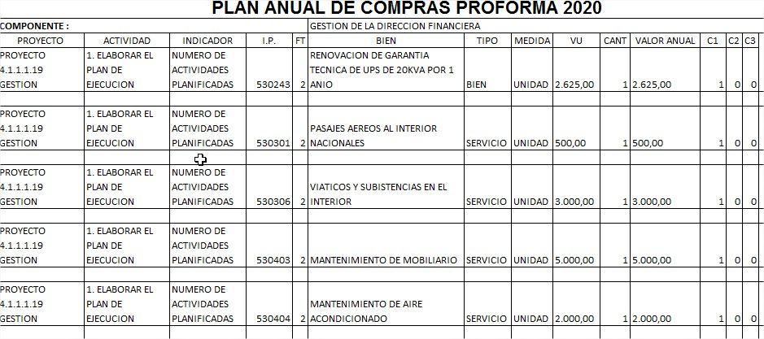
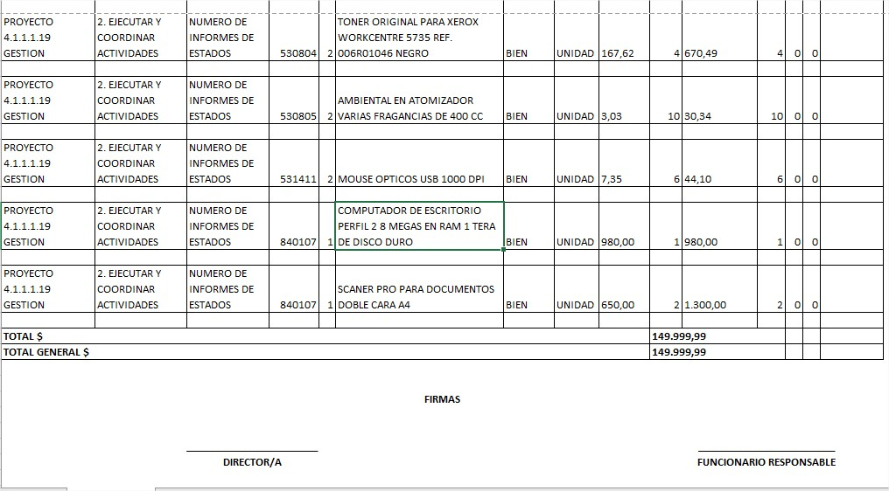

# DETALLE PAC

Para proceder a generar el reporte detallado del PAC se procede en el menu del sistema :

>  REPORTES ->DETALLE PAC

El reporte permite generar un archivo excel con el detalle por cada uno de los valroes registrados

