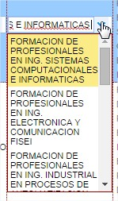
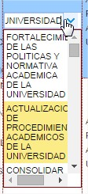

# OBJETIVO DOCUMENTO

## Notas generales :

## Iconos de las operaciones comunes :

 = Permite creación de nuevos registros en todos los módulos.

 = Permite eliminara un registro de datos en todos los módulos.

 = Permite grabar los cambios en los registros de datos.

  = Permite eliminar los cambios en los registros de datos.

 = Permite ingresar al sistema posterior a ingresar el usuario y clave

 = Permite selecionar del listado desplegable en el caso se presente.

 = Permite procesar e iniciar los procesos de POA Y PAC

 = Subir un nivel en formulario de registro.
