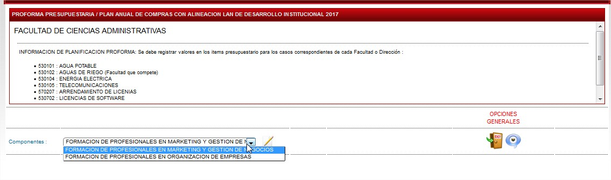
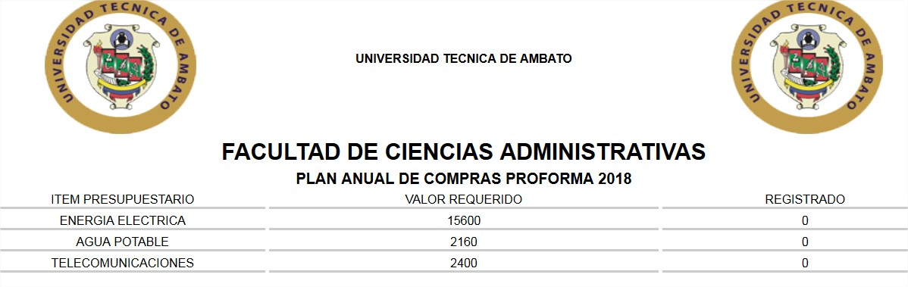
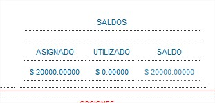
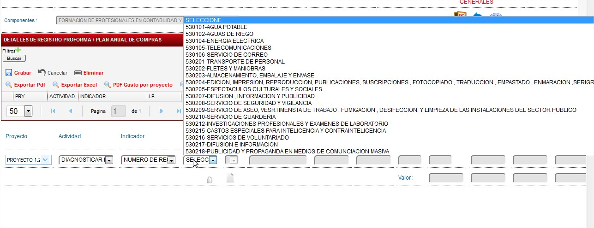
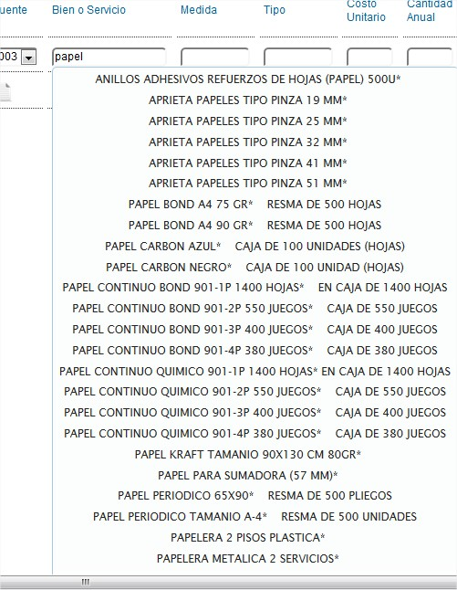
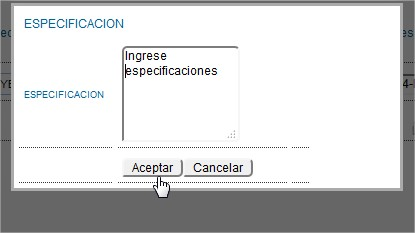
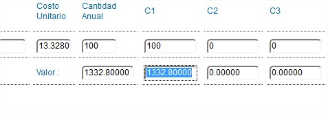
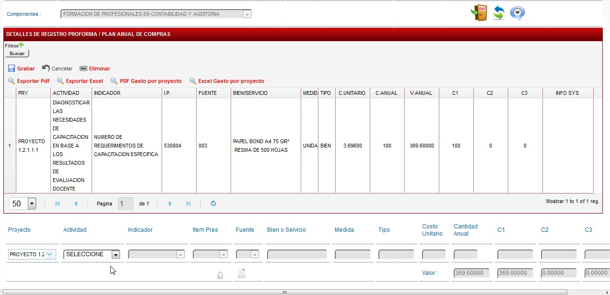

# PLAN ANUAL DE COMPRAS

Inicio del proceso :

Se presenta la siguiente información :

Tenemos las consideraciones generales sobre las items presupuestarios que se deben planificar especialmente en facutlades en la parte superior.

En al area de componente tenemos los que se activar para poder realizar el pac de cada uno de ellos con los techos previamente asignados-

**SOLO SE REFLEJAN LOS COMPONENTES QUE TENGAN TECHO PRESUPESTARIO.**

En lo referente a Item Obligatorios , se tiene el icono de ayuda en el que se despliega la informacíon previamente cargada.

Y se puede observar que valores debe reflejar a nivel global en la suma de todos los componentes en estos items presupuestarios.

Ademas se refleja el valor registrado a la fecha en sumatoria de estos valores .

Una vez procesado el componente a planificar en la parte superior de la pagina se refleja el techo asignado y como el mismo va disminuyendo segun como se cargue la información.

Con los datos antes expuestos se procede a realizar la planificación del Plan Anual de Compras

En el que se debe seleccionar como en el Plan Operativo Anual :

Proyecto , Actividad , Indicador como datos iniciales (SOLO SE REFLEJAN LOS PLANIFICADOS).

Posterior a ellos se debe SELECCIONAR EL ITEM PRESUPUESTARIO QUE SE MUESTRA EN LA IMAGEN ANTERIOR.

Seguidamente se debe digitar el nombre del bien que se necesite planificar su adquisición, lo seleccionamos.

En el caso de necesitar desplegar el total del listado por ITEM PRESUPUESTARIO solo digite la letra A.

Una vez seleccionado el bien / servicio de adquisición se muestra el formulario en que se debe poner las especificaciones exactas y tecnicas de lso bienes o servicios a adquirir.

Una vez dado click en ACEPTAR se depliega la información sobre ese bien y segun sea el caso :

BIEN : Digitar la cantidad ANUAL a adquirir y el Cuatrimestre para el mismo.

SERVICIO : Ingresae el Costo Unitario , Cantidad Anual y el Cuatrimestre.

Finalmente dar click en + de color verde para poder grabar .

Una vez realizado este proceso se refleja la información de esta manera

Y se tiene las opciones de exportar este detalle a PDF, EXCEL.
