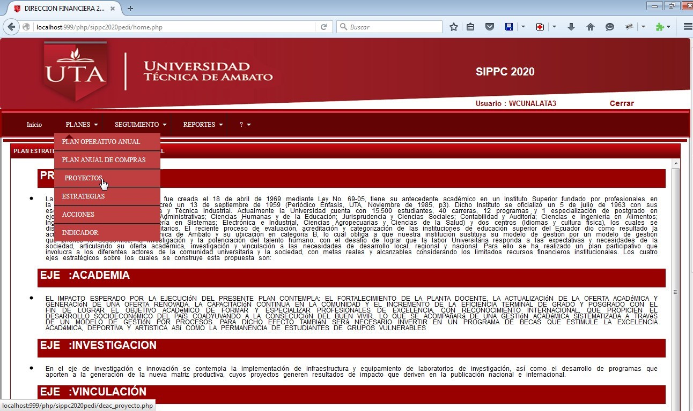
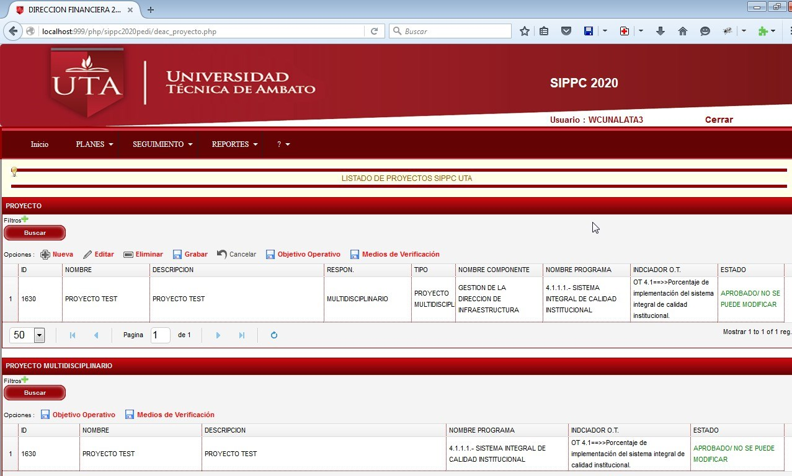
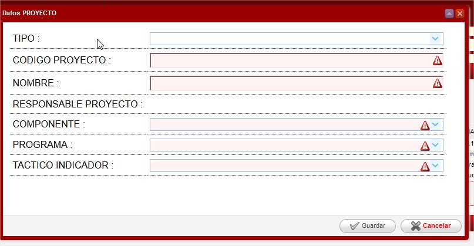
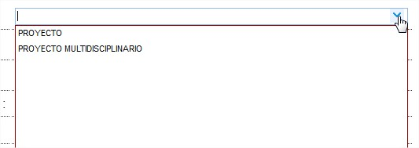
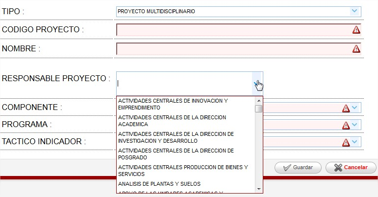
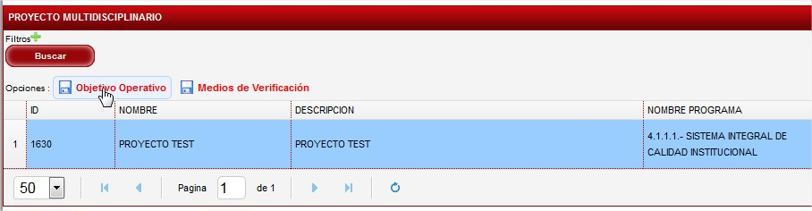
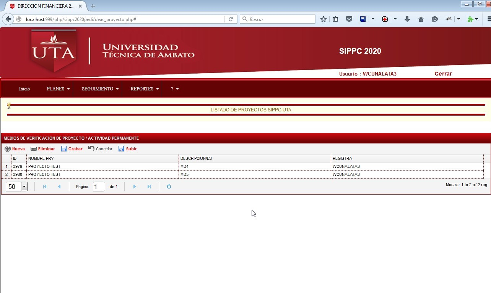
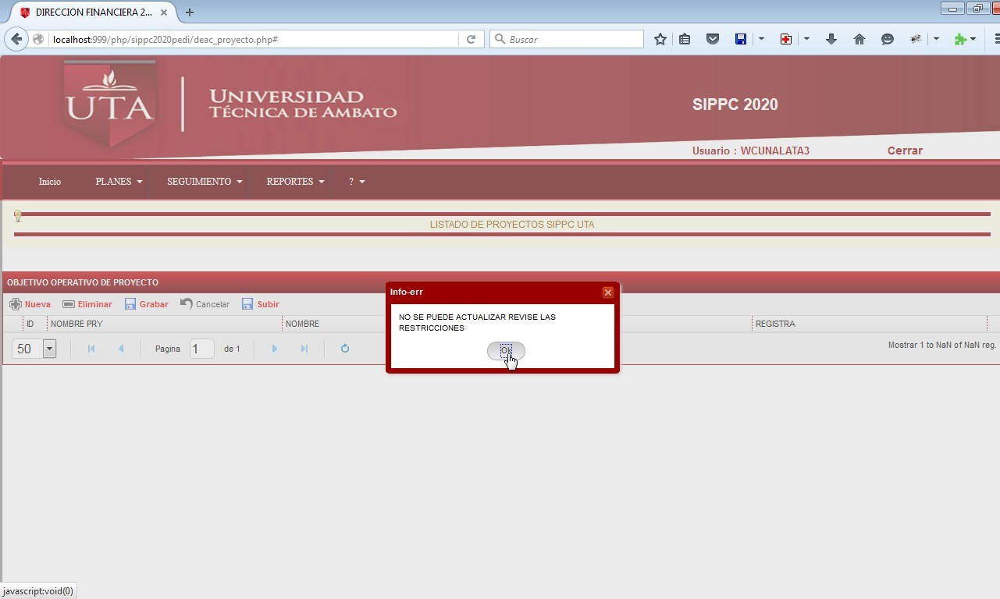
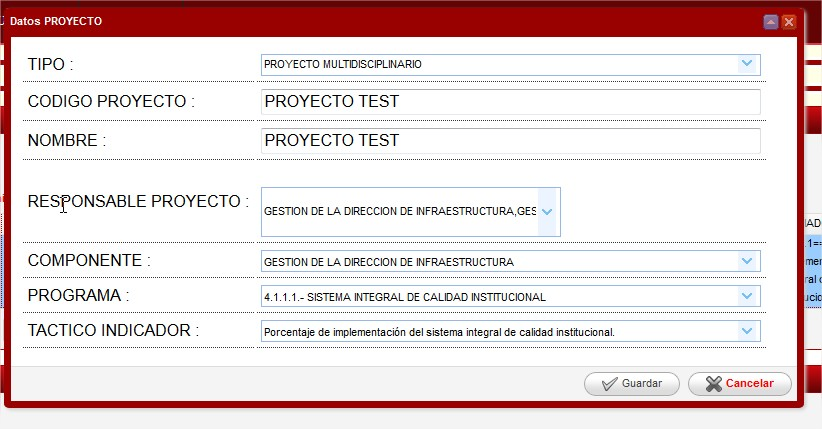

# PROYECTO

Una vez ingresada al sistema, para acceder a Proyectos se debe ingresar por el menu :

Se nos muestra la siguiente información :

En la que se puede :

Agregar filtros de información de los proyectos y trabajar con un proyecto específico.

En opciones se puede Crear nuevo proyecto , eliminar nuevo proyecto aun no aprobado , grabar los cambios , cancelar los cambios , verificar objetivo operativo, medios de verificación.

En Nuevo Proyecto se presente el formulario con los soguientes parametros:

En primer parametros es el tipo de proyectoel cual da las opciones :

En el cual se tiene proyecto (de tipo personal para cada una de las dependecias o carreras) y las tipo Multidisciplinario (implica que son proyectos que se van a trabajar con otras dependencias o carreras).

Cuando selecciona el proyecto tipo Multidisciplinarios se mostra la informacion de responsable de la siguiente manera:

Se observa que como es tipo multidisciplinario se carga el listado de todas las dependencias y carreras para el registro .

Simplemente se debe ir marcando cuales van a ser los componentes que van a trabajar con este proyecto.

Una ves definido estos parametros se debe registrar el codigo de proyecto (PROYECTO 1.1.1.1.11) , componente que registra el proyecto , el programa (Listado de los programas Macro de la Institución), Indicador de Tactico(el cual s e filtra segun el Programa).

.jpg>)

Una vez registrada los parametros solicitados dar click en grabar y el proyecto se refleja en el sistema en estado registrado .

En el caso de los proyectos multidisciplinarios tambien se les refleja a las dependencias / carreras que estan registradas en los proyectos.

Como se puede observar cuando se carga un proyecto multidisciplinario se presente como la imagen siguiente a las dependencias relacionadas.

Lo que deben registrar son los medios de verificación que corresponde a cada dependencia relacionada.

Una vez que se realiza el registro de estos datos el DEAC procedera a revisar y aprobar los proyectos .

Posterior a esto los proyectos ya no pueden ser modificados y se reflejaran mensajes como el siguiente:

**MODIFICACIÓN DE PROYECTO**

Para realizar la modificación de un proyecto se debe dar click en el registro y dar click en Editar en el cual se refleja :

Pueden realizar los cambios de todos los campos del proyecto.

Una vez realizado los cambios dar click en grabar .

Se debe tomar en consideracion el estado del PROYECTO, el cual una vez q se modifique o se registre estos tienen el estado INGRESADO; para que pase a estado APROBADO debe realizarlo el DEAC.

Una vez que este APROBADO se podra realizar el PLAN OPERATIVO ANUAL con los proyectos.
