# REGISTRO PLAN OPERATIVO ANUAL

Se debe ingresar posterior a realizar todas las operaciones en PROYECTOS y se encuentren en estado APROBADO

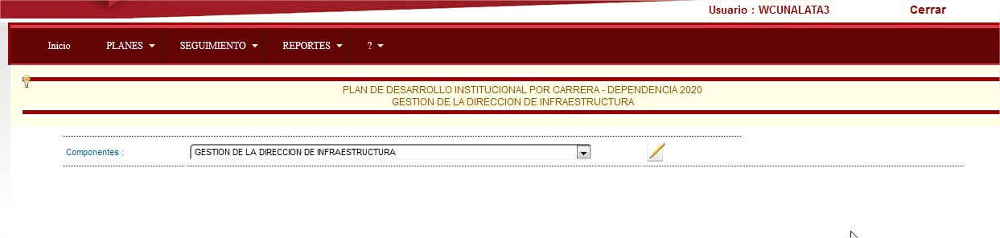

Se presenta el formulario anterior y se debe seleccionar el componente y dar click en 

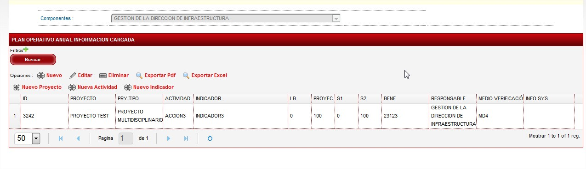Generando la siguiente información en la que se refleja en primera parte la que se encuentra registrada en caso de existirla.

con las opciones basicas.

Para el registro de lieas de planificación se debe primero seleccionar :

Entre las opciones basicas tenemos :

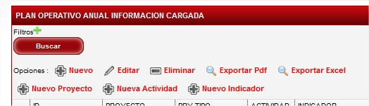

El cual permite solicitad NUEVO PROYECTO / NUEVA ACTIVIDAD / NUEVO INDICADOR .

Para el registro de las lineas de planificación se presente el siguiente formulario :

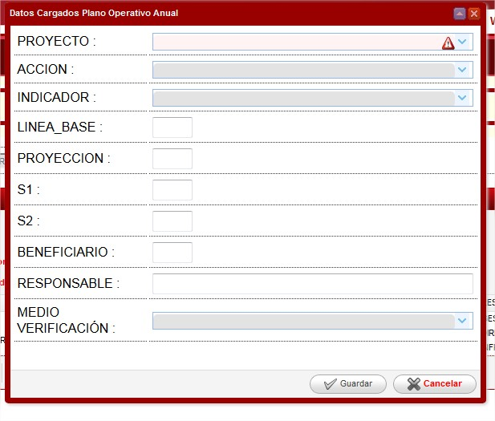

En el cual se debe Selecciona:

Proyecto Aprobabado , Actividad Aprobada, Indicador Aprobado .

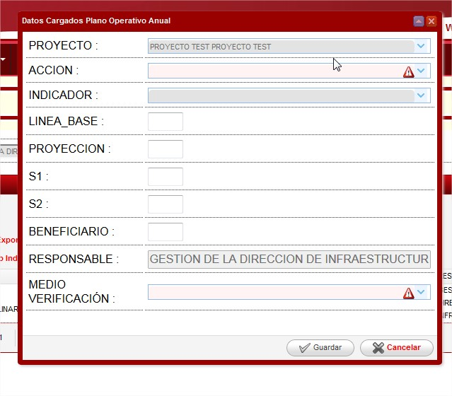

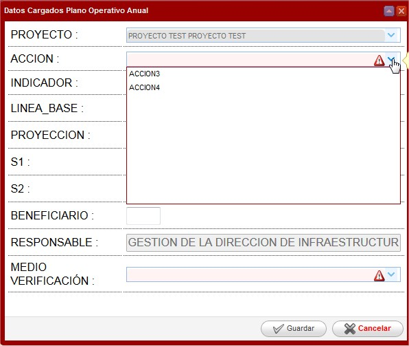

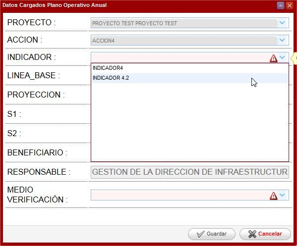

Ademas de :

LINEA BASE % : Lo alcanzado en cada año , en caso de ser nuevas debe ser 0.

PROYECCIÓN % : La proyección de la planificación sobre actividad/ indicador.

S1: Porcentaje de avance al Semetre1(puede ser 0 , a desarrollarse todo en el semestre2).

S2: Porcentaje de avance al Semetre2.

Beneficiarios : Número de beneficiarios (entidad tipo educación deberian ser los estudiantes).

Responsable: El cargo de la persona que esta a cargo de esta actividad / indicador.

Cuando se realiza el registro de Linea Base, Proyección , S1, S2 el sistema realiza las respectivas validaciones previo a grabar y genera mensajes como el que se ve a continuación..jpg>)

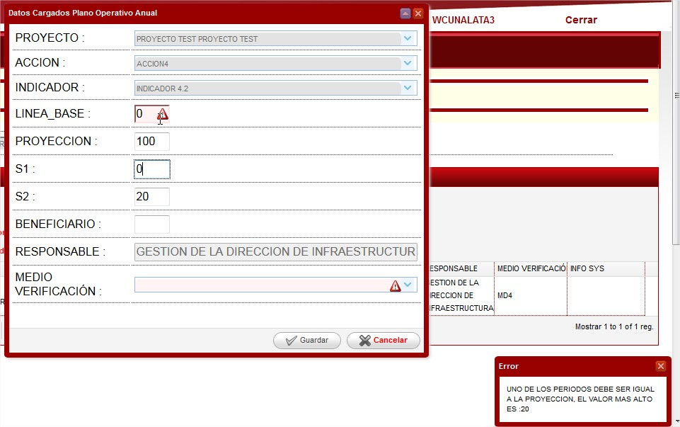Para el caso de los Beneficiarios el sistema tiene un control sobre la cantidad maximo que es de 50000 , si se registra un valor superior automaticamente se cambiar al valor maximo.

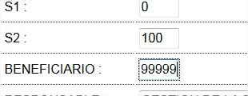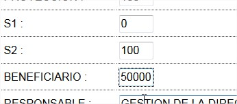

El lo referente al responsable , cuando el proyecto es multidisciplinarios SE REGISTRA DE MANERA AUTOMATICA EL NOMBRE DEL COMPONENTE.

Todos los campos que se reflejan obligatorios por lo que el formulario no grabar hasta q esten registrado de manera correcta.

Una vez grabado se refleja los datos de la siguiente manera :

: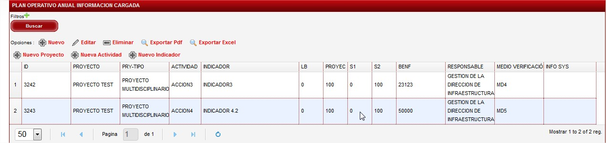

**Modificar Planificación Registrada**

Para realizar la plnaificación registrada se lo realizar seleccionado uno de los registros y dar click en EDITAR:

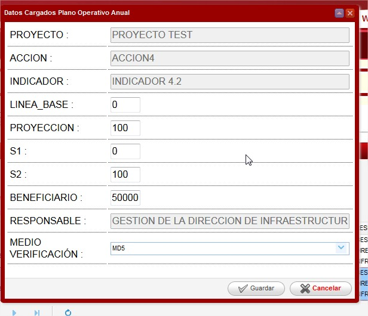

Se presente el formulario en el cual se habilitan los campos que son modificables sobre esta linea de planificación .

Para finalizar se debe dar click en Grabar y se registra los cambios en el sistema.

**Transferencia de Componentes POA / PAC**&#x20;

Una vez que se ha registrado las lineas de planificación se puede realizar la transferencia de el componente al Modulo del PAC.

Dando click en el boton TRANSFERIR COMPONENTE DE POA A PAC y se graba el estado de toda la planificación de este componente para la asignación de recuros economicos.

Obteniendo la planificación de la siguiente manera :En caso de que se necesite realizar algun cambio a nivel de valores dar doble click en el registro :En el que se puede modificar los campos que se habilite , finalment click en grabar.
