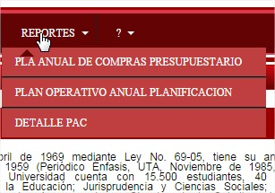
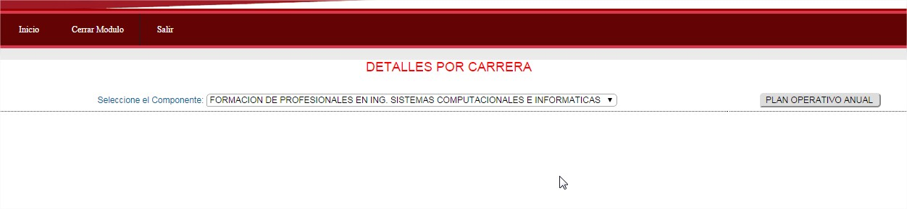
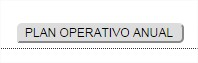
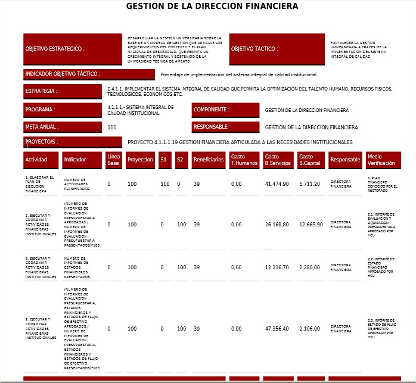

# REPORTE PLAN OPERATIVO ANUAL

Menu :

En el cual se refleja la siguente información.

En caso de no tener aprobado en el POA, no se refleja ninguna información.

Para genera el reporte seleccionamos el componente y dar click en el boton 

Generando el reporte :

Mismo que se debe enviar a aprobar en CONSEJO .
